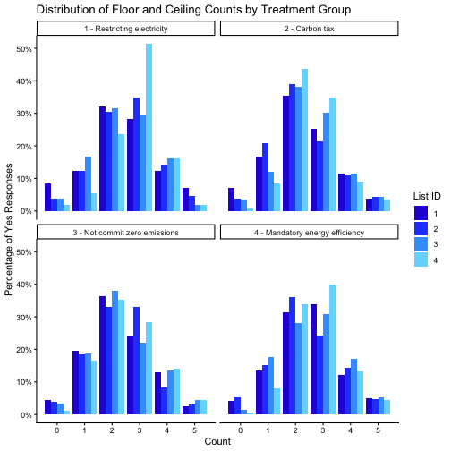
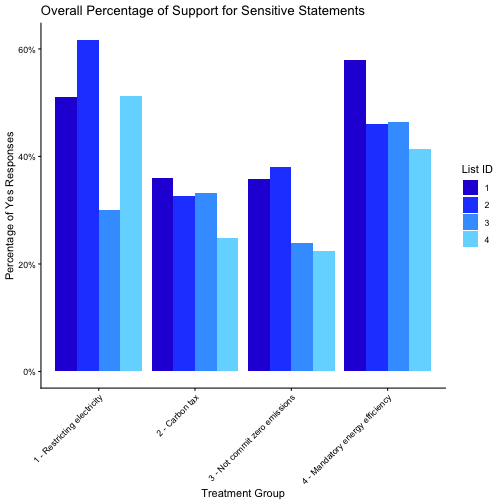
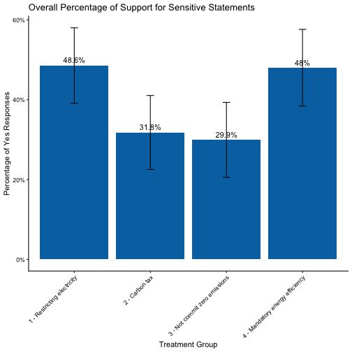

## Validating the floor and ceiling of treatment groups
This step validates if the list experiment is working as intended.
Selecting floor or ceiling counts (namely, 0 or 5) for the treatment groups
will reveal the answer to the sensitive question.
The below plot shows that the floor and ceiling all combined is around 10%
of the total responses for each treatment group,
which should be comparable to the existing literature if not lower.



## Overall percentage of support for sensitive statements


Below table shows the percentage of "yes" for each sensitive statement by control list:


```
##                          treatment list_id      mean         sd
## 1      1 - Restricting electricity       1 0.5104881 0.10758364
## 2      1 - Restricting electricity       2 0.6170209 0.09722406
## 3      1 - Restricting electricity       3 0.3000848 0.10168917
## 4      1 - Restricting electricity       4 0.5130787 0.07911192
## 5                   2 - Carbon tax       1 0.3589855 0.10321752
## 6                   2 - Carbon tax       2 0.3267460 0.09632404
## 7                   2 - Carbon tax       3 0.3317285 0.09083030
## 8                   2 - Carbon tax       4 0.2486412 0.08504887
## 9    3 - Not commit zero emissions       1 0.3580804 0.09938556
## 10   3 - Not commit zero emissions       2 0.3805465 0.09210989
## 11   3 - Not commit zero emissions       3 0.2385630 0.09953159
## 12   3 - Not commit zero emissions       4 0.2232068 0.09282431
## 13 4 - Mandatory energy efficiency       1 0.5801750 0.10182590
## 14 4 - Mandatory energy efficiency       2 0.4606824 0.10286821
## 15 4 - Mandatory energy efficiency       3 0.4632472 0.10191623
## 16 4 - Mandatory energy efficiency       4 0.4133407 0.08451675
```

A plot of the above table. There appears to be some degrees of design effects, namely, the percentage of "yes" responses for the sensitive statements varies by the control list.
However, there is not clear pattern that suggest a particular list more likely to get "yes" responses.



A plot of the average mean and 95% confidence level error bar for sensitive statement:



## A intercept only model
The estimated probability of answering "yes" to the sensitive statements is the inverse logit of the coefficient.
The below table shows the estimated probability of answering "yes" to the sensitive statements by control list.
The results are consistent with the overall percentage of support for sensitive statements.
The standard errors of the control list effects were calculated using the delta method.


```
##                      statement        control     Prob. coefficient         SE
## 1      Restricting electricity Control List 1 0.5107758  0.04311006 0.32628185
## 2      Restricting electricity Control List 2 0.6117795  0.45479856 0.39011905
## 3      Restricting electricity Control List 3 0.3139744 -0.78160360 0.42881446
## 4      Restricting electricity Control List 4 0.4487110 -0.20588017 0.51384565
## 5                   Carbon tax Control List 1 0.3792319 -0.49280952 0.36704356
## 6                   Carbon tax Control List 2 0.3468141 -0.63307292 0.36978341
## 7                   Carbon tax Control List 3 0.3466537 -0.63378114 0.38976732
## 8                   Carbon tax Control List 4 0.1987311 -1.39424411 0.48598837
## 9    Not commit zero emissions Control List 1 0.3699126 -0.53259173 0.39375179
## 10   Not commit zero emissions Control List 2 0.3761272 -0.50601894 0.41236653
## 11   Not commit zero emissions Control List 3 0.2978059 -0.85776815 0.37593594
## 12   Not commit zero emissions Control List 4 0.2466019 -1.11681839 0.39634986
## 13 Mandatory energy efficiency Control List 1 0.5750205  0.30236461 0.37024034
## 14 Mandatory energy efficiency Control List 2 0.4666670 -0.13352992 0.36215684
## 15 Mandatory energy efficiency Control List 3 0.4831090 -0.06758964 0.37222744
## 16 Mandatory energy efficiency Control List 4 0.3582989 -0.58275485 0.43341620
## 17     Restricting electricity        Average 0.4694397 -0.12239379 0.01882246
## 18                  Carbon tax        Average 0.3124958 -0.78847692 0.21014457
## 19   Not commit zero emissions        Average 0.3201028 -0.75329930 0.20303386
## 20 Mandatory energy efficiency        Average 0.4699419 -0.12037745 0.19740625
```

However, there seems to be some degree of design effects.
Also, the design effects seems more pronounced for the sensitive statement 1, i.e., restricting electricity, than the others.
The table below shows the p-value of the effect of control list on the probability of answering "yes" to the sensitive statements relative to each other.
For example, the first row shows the effect of control list 1 minus the effect of control list 1, 2, 3, and 4 for each sensitive statement.
The p-value is calculated using the delta method.


```
##                      statement   control_list vs. Control List 1, p-value
## 1      Restricting electricity Control List 1                           -
## 2      Restricting electricity Control List 2                  < 0.001***
## 3      Restricting electricity Control List 3                  < 0.001***
## 4      Restricting electricity Control List 4                  < 0.001***
## 5                   Carbon tax Control List 1                           -
## 6                   Carbon tax Control List 2                       0.783
## 7                   Carbon tax Control List 3                       0.794
## 8                   Carbon tax Control List 4                       0.139
## 9    Not commit zero emissions Control List 1                           -
## 10   Not commit zero emissions Control List 2                       0.959
## 11   Not commit zero emissions Control List 3                       0.544
## 12   Not commit zero emissions Control List 4                       0.337
## 13 Mandatory energy efficiency Control List 1                           -
## 14 Mandatory energy efficiency Control List 2                       0.445
## 15 Mandatory energy efficiency Control List 3                       0.497
## 16 Mandatory energy efficiency Control List 4                       0.113
##    vs. Control List 2, p-value vs. Control List 3, p-value
## 1                   < 0.001***                  < 0.001***
## 2                            -                  < 0.001***
## 3                   < 0.001***                           -
## 4                   < 0.001***                  < 0.001***
## 5                        0.783                       0.794
## 6                            -                       0.999
## 7                        0.999                           -
## 8                        0.238                       0.256
## 9                        0.959                       0.544
## 10                           -                       0.513
## 11                       0.513                           -
## 12                       0.317                       0.678
## 13                       0.445                       0.497
## 14                           -                       0.906
## 15                       0.906                           -
## 16                       0.432                       0.346
##    vs. Control List 4, p-value
## 1                   < 0.001***
## 2                   < 0.001***
## 3                   < 0.001***
## 4                            -
## 5                        0.139
## 6                        0.238
## 7                        0.256
## 8                            -
## 9                        0.337
## 10                       0.317
## 11                       0.678
## 12                           -
## 13                       0.113
## 14                       0.432
## 15                       0.346
## 16                           -
```

## Demographic Effects

```
## Error in fread("./csv/dt_list_with_demo.csv"): File './csv/dt_list_with_demo.csv' does not exist or is non-readable. getwd()=='/Users/yufeng.lai/Documents/carbon_footprint/consumer_WTP_carbon_footprint'
```

### Model using information treatment

```
## Error in eval(expr, p): object 'dt_est' not found
```

```
## Error: object 'ict_fit_info' not found
```

### Climate Awareness, Q5
For this part, we planed to include both Q5 and Q7, but Q7 will result in singular matrix. For climate_important, Q5 >= 4, i.e., important or very important.

```
## Error in eval(expr, p): object 'dt_est' not found
```

```
## Error: object 'ict_fit_att' not found
```

### Climate Attitudes, First Principal Component of Q12

```
## Error in eval(expr, p): object 'dt_est' not found
```

```
## Error: object 'ict_fit_pca_q12_pc1' not found
```

### Climate Attitudes, First Principal Component of Q10

```
## Error in eval(expr, p): object 'dt_est' not found
```

```
## Error: object 'ict_fit_pca_q10_pc1' not found
```

### Climate Attitudes, First Principal Components of Q12 and Q10

```
## Error in eval(expr, p): object 'dt_est' not found
```

```
## Error: object 'ict_fit_pca_q12_q10_pc1' not found
```

### Combined Model: First Principal Components of Q12, Q10 and Demographics

```
## Error in eval(expr, p): object 'dt_est' not found
```

```
## Error: object 'ict_fit_pca_q12_q10_demo' not found
```
